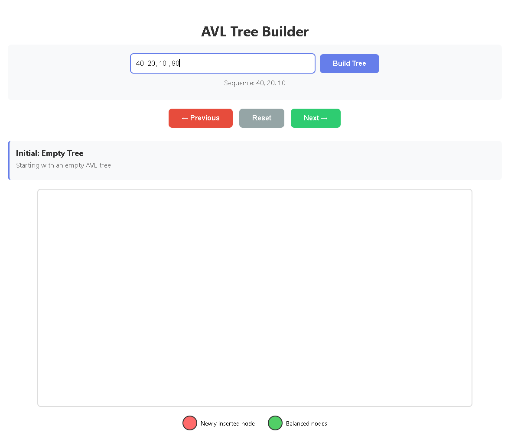
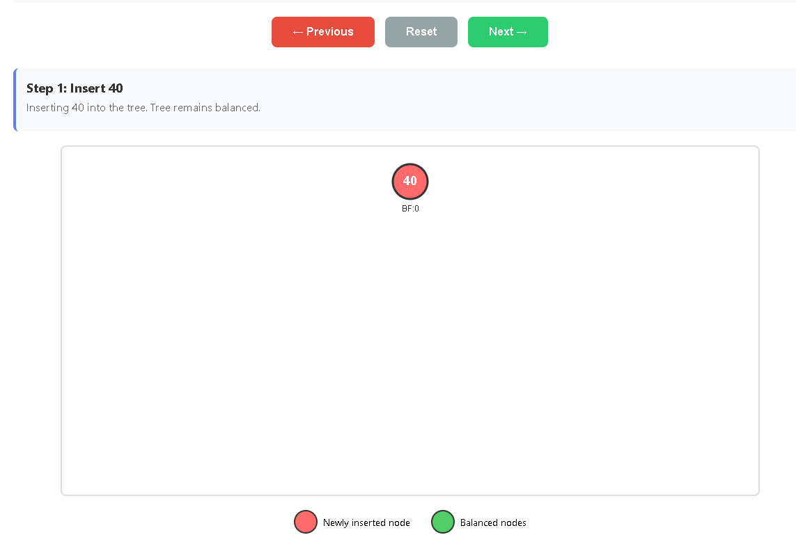
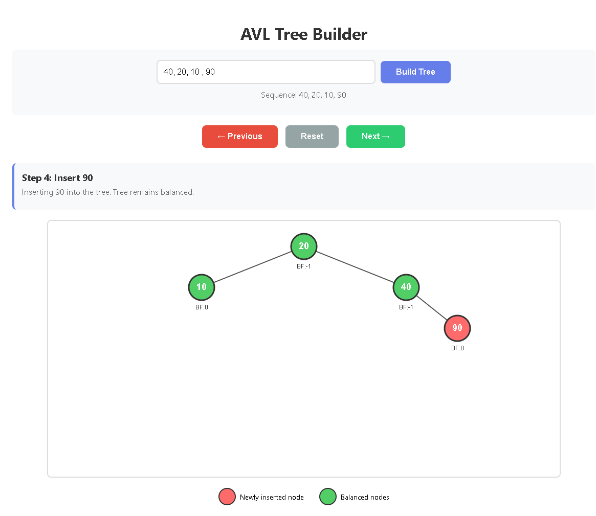

# AVL Tree Visualizer

An interactive, step-by-step visualizer for AVL tree construction — built to make tree balancing and rotation logic actually visible instead of something you trace on paper.

---

## screenshots





---

## Why I Built This

After implementing AVL trees from scratch in C++ for a Data Structures course, I wanted a way to actually *see* what each rotation does instead of just trusting the code worked. This combines that DSA knowledge with frontend skills — the insertion and rotation logic is a direct port of the C++ algorithm into JavaScript, rendered step-by-step on an HTML5 Canvas so every insert, imbalance, and rotation is visible in isolation.

---

## Tech Stack

- **HTML5 Canvas** — tree rendering
- **Vanilla JavaScript** — AVL insertion, rotation, and balance-factor logic
- **CSS** — UI styling
- No frameworks, no backend, no build step

---

## Features

- **Step-by-step playback** — insert one value at a time and step forward/backward through the tree's evolution
- **All four rotation cases** — LL, RR, LR, and RL detected and labeled automatically as they happen
- **Balance factor display** — every node shows its live BF, so imbalance is visible the instant it occurs
- **Visual diff per step** — newly inserted node highlighted in red, balanced nodes in green
- **Custom input** — type any comma-separated sequence of numbers to build your own tree
- **Duplicate handling** — repeated values are automatically filtered out before insertion

---

## Setup

```bash
git clone https://github.com/yourusername/avl-visualizer.git
cd avl-visualizer
```

No dependencies, no build step — it's a single static HTML file.

---

## Usage

Open `index.html` directly in any browser.

---

Enter a comma-separated list of numbers (e.g. `40, 20, 10, 25, 30`), click **Build Tree**, then use **Next →** and **← Previous** to step through each insertion. Whenever a rotation occurs, it's labeled directly above the tree (e.g. *"Right Rotation (LL Case)"*).

---

## Project Structure

```
avl-visualizer/
├── assets/        # Screenshots and demo media for README
├── index.html     # Everything — markup, styles, and logic in one file
└── README.md
```